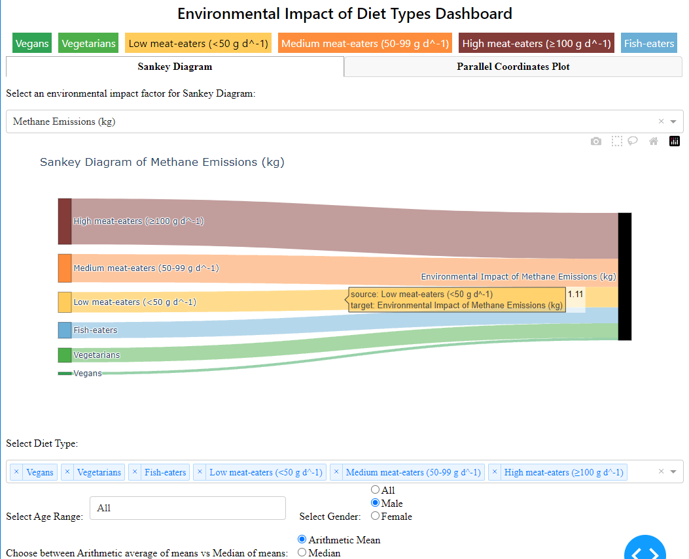
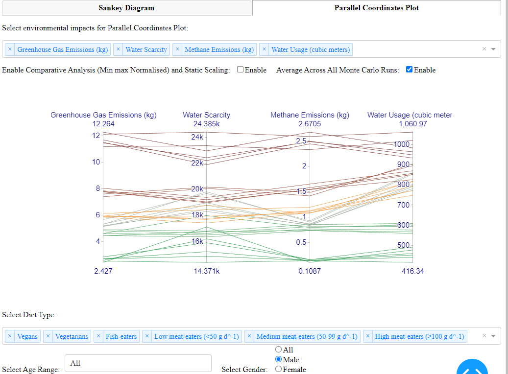
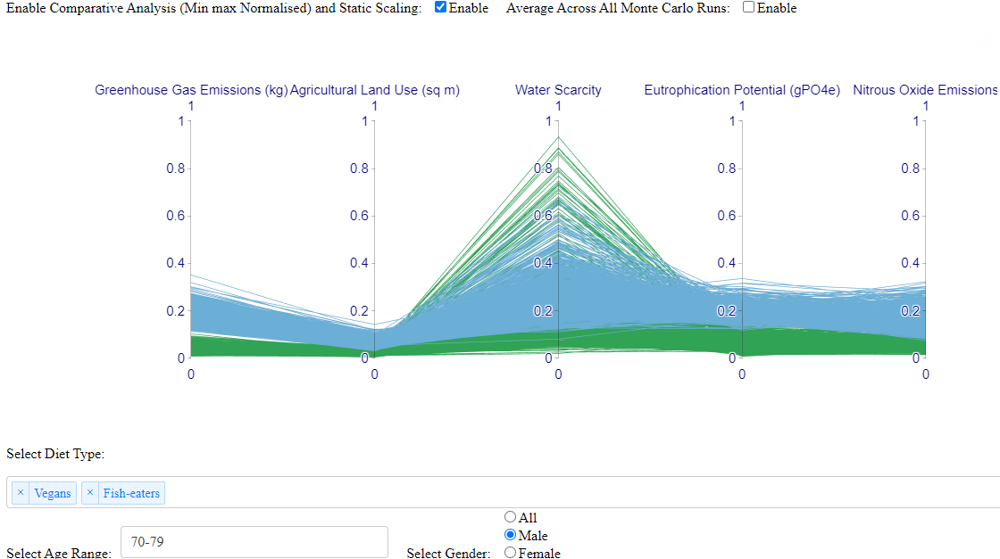

> ●**Dashboard** **of** **Sankey** **Diagram** **and** **Parallel**
> **Coordinate** **Graph** with numerous filtering options.

● **Tools**: Web application based on Python and Libraries: Dash: This
framework, built on Flask, Plotly.js, and React.js, powers the web
application, enabling interactive functionalities without direct
JavaScript usage. Plotly: This library was used for creating interactive
graphs within the Dash app. Pandas: Essential for data manipulation and
analysis, this library was employed to load, normalize, and tailor
datasets for visualization, accommodating user-specific inputs such as
diet type, age, and gender.HTML and CSS (implicitly through Dash
components)

● **Diet** **Groups**: Generally all, but depends on the filters set by
the user.

● **Variables**: Users have the option to display all or select some
from the following variables: Greenhouse Gas Emissions (kg),
Agricultural Land Use (sq m), Water Scarcity, Eutrophication Potential
(gPO4e), Methane Emissions (kg), Nitrous Oxide Emissions, Biodiversity
Impact (species extinction per day), Water Usage (cubic meters), and
Acidification Potential. Each of these variables was chosen to provide a
comprehensive view of the environmental impacts associated with specific
diet types. Additionally, users can filter the data by age group or
gender as desired. This allows for more targeted and informative
analyses based on

> user-defined criteria.
>
> ● **Visual** **Mappings**: A color-coded legend is used to
> differentiate diet types: Vegans (green), Vegetarians (light green),
> Fish-eaters (blue), Low meat-eaters (yellow), Medium meat-eaters
> (orange), and High meat-eaters (dark red). Color consistency across
> the Sankey diagram and Parallel Coordinates Graphs aids quick
> identification of each diet type. style="width:5.46875in;height:1.91667in" />
>
> 1\. **Sankey** **Diagram**:
>
> ● The diagram depicts the diet types and their relative environmental
> impacts. Flow width indicates the impact size. This allows users to
> focus on the flow and relative contribution of each diet type to a
> particular environmental issue. The selected impact determines the
> size and destination of the flows, directly visualizing the proportion
> of each diet’s contribution.
>
> ● Selectable Environmental
>
> Impact: Users can choose a specific environmental impact to visualize,
> such as greenhouse gas emissions or water usage, focusing on the
> relative contributions of each diet type.
>
> 2\. **Parallel** **Coordinates** Plot: Each axis represents a
> different environmental impact, enabling comparisons across variables.
> Users can select, move around, and customize the axes Axes can be
> customized based on selected environmental factors.
>
> ● Enabling Comparative Analysis and Static Scaling option: Makes the
> scales of all the axes static and performs normalization of data
> within each environmental impact variable so the range becomes 0-1,
> making it easier to compare data across diverse environmental impact
> variables. E.g, comparing greenhouse gas emissions measured in
> kilograms with water usage measured in cubic meters becomes feasible
> because both are rescaled to the same range.
>
> ● Data Representation: A line can represent a single data instance,
> averages across multiple runs, age groups, or genders, depending on
> user selection, offering detailed analytical flexibility.
>
> 3\. **Filtering** and **Data** **Manipulation** **Options**: Diet
> Type: Enables users to focus on specific dietary groups. Age Group and
> Gender: Allows further segmentation for detailed demographic analysis.
> Statistical Measures (Mean or Median): Options for data aggregation
>
> ● **Unique** **Observation**: When we plot all the instances of the
> Monte Carlo runs(1000) for a single age group of any diet group while
> enabling normalized scales so all the environmental scales are
> rescaled to the same range(0-1). Water Scarcity always shows the
> highest variability in min and max values as in its range is much
> wider compared to other environmental factors. The same results are
> consistent for any single age group, across all diets, and with both
> genders. Example shows data for the 70-79 age group of vegans and fish
> eaters

This suggests that the effect of dietary choices on water scarcity is
less uniform than other environmental impacts ● Data Preparation: The
dashboard allows users to filter data based on diet type, age group, and
gender. This

> dynamic filtering adjusts the dataset in real time, tailoring the
> visualization to user preferences. Depending on user selection, data
> can be aggregated by mean or median, either across the entire dataset
> or within specified subgroups (e.g., by age or gender). This
> flexibility supports comparing typical values (median) versus average
> outcomes (mean). For the parallel coordinates plot, environmental
> impact metrics are normalized to a 0-1 scale when the option is
> enabled to ensure comparability across diverse variables.
>
> ● URL to screen-capture demo
> [<u>https://youtu.be/U0I_2fygMgU</u>](https://youtu.be/U0I_2fygMgU)
>
> ● URL to source code:
> [<u>https://github.com/mustafameh/CW2ResearchMethods</u>](https://github.com/mustafameh/CW2ResearchMethods)
